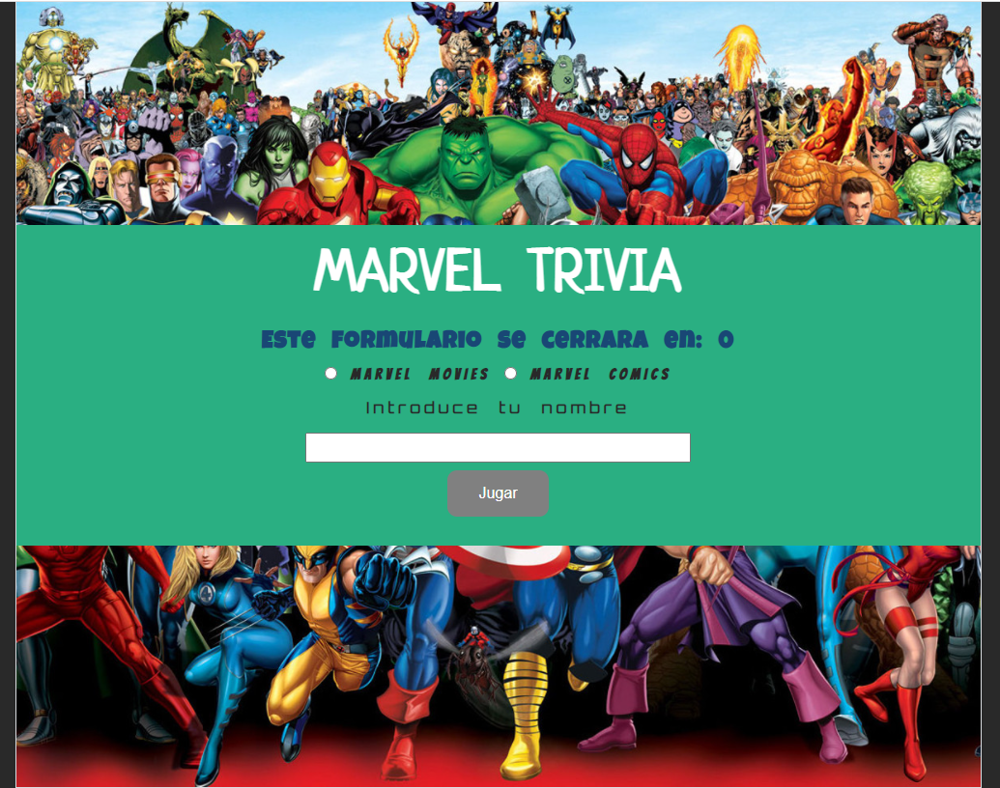

# Marvel__Trivia
🧩 Marvel Trivia 💻 was initially created to study the principles of web development, but it was also the initial challenge to get into Laboratoria &lt;💛>. 

This project was created in teams [Nicol Rodriguez and Marielena Aizaga] and here you can find questions related to marvel movies! 🎬🎥

    

***
<h3>Main view</h3>

    

 

 📌 1) You can enter by choosing between the two categories (Movies or Comics)

 📌 2) You must enter your name and click on the button "Jugar" 

    

 

 📌 3) Once the game has started, the section where the trivia questions are is displayed.

 📌 4) When you finish answering you can check the answers in the button "Respuestas Correctas".

 📌 5) If you want to play again you can click the  button "Volver a jugar"

    

 ⚠ IMPORTANT ⚠ If you take more than 90 seconds to respond, the view will close. 

***

tambien puedes visualizar la primera versión desplegada en replit 👉 

